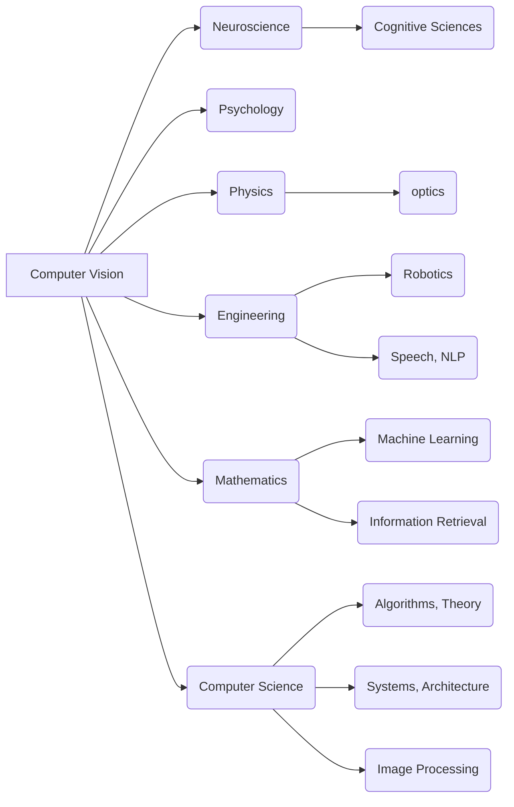

## 1. What is Computer Vision?

### 1.1 Definition

*   **Definition 1:** *Computer vision is a scientific field that extracts information from digital images.*  The information can range from object identification, spatial measurements (for navigation), to data for augmented reality.
*   **Definition 2:** *Computer vision involves building algorithms that understand image content and use it for various applications.*

**History:**

*   Originated from an MIT undergraduate summer project in 1966.
*   Initially thought to be solvable quickly, but it remains a complex, evolving field after 50+ years.

### 1.2 An Interdisciplinary Field

Computer vision draws from many disciplines:

*Example Interconnections*
*   **Neuroscience:**  Helps understand human vision to inspire computer vision algorithms.
*   **Computer Science:** Provides the algorithmic and theoretical foundation (e.g., algorithm theory, machine learning).
* **Physics**: Understanding of optics and light.
* **Engineering**: Robotics, image sensors.

### 1.3 A Hard Problem

*   Computer vision is deceptively difficult for computers, despite being effortless for humans.

**Illustrative Comparisons:**

*   **Poetry harder than chess:**  IBM's Deep Blue beat Garry Kasparov (chess) in 1997, but generating coherent text (let alone poetry) remains challenging.  This highlights that human-perceived "intelligence" isn't always a good measure of computational difficulty.
*   **Vision harder than 3D modeling:**  Creating precise 3D models is easier than robust object recognition (e.g., identifying all chairs).

**Why is it so hard?**

*   **The gap between pixels and meaning:** A $200 \times 200$ RGB image contains $120,000$ values.  Extracting meaningful information from these raw numbers is a significant challenge.
*   **Analogy to the human brain:** The human visual cortex processes signals from the retina, facing a similarly complex task.

## 2. Understanding Human Vision

*   Studying human vision can provide insights for computer vision.

### 2.1 Definition of Vision

Vision (human or computer) involves two key components:

1.  **Sensing Device:**
    *   **Human:**  The eye captures light, projects it onto the retina, and specialized cells transmit signals to the brain.
    *   **Computer:** A camera captures images and transmits pixel data. Cameras can surpass human capabilities in some aspects (e.g., infrared vision).
2.  **Interpreting Device:**
    *   **Human:** The brain processes information in multiple stages across different regions.
    *   **Computer:**  Algorithms process pixel data to extract meaning. This is where computer vision still lags behind human performance.

### 2.2 The Human Visual System

*   **Hubel & Wiesel (1962):** Studied cat visual systems, finding specialized neurons that responded to specific line orientations and positions on the retina.  This was a foundational discovery in understanding visual processing. Nobel Prize in 1981.

### 2.3 How Good is the Human Visual System?

*   **Speed:** Highly efficient; evolved for survival.  Recognition of an animal in a natural scene takes approximately $150ms$.

*   **Fooling Humans:**  The focus on speed and essential features means that minor image details (reflections, background) can be easily missed.
*   **Context:**  Humans heavily rely on context and prior knowledge to interpret images.  This is a major challenge to incorporate into computer vision systems.  Context helps:
    *   Focus attention.
    *   Form expectations.
    *   Compensate for lighting variations (e.g., shadows).
    *   But, context can also lead to illusions and misinterpretations.

### 2.4 Lessons from Nature

*   **Analogy to flight:**  Directly copying birds didn't lead to airplanes.  Understanding the underlying principles (aerodynamics, lift) was key.
*   **Implication for AI:**  Simulating a full human brain might not be the optimal path to artificial intelligence.  Understanding the fundamental concepts behind vision, language, etc., may be more fruitful.

## 3. Extracting Information from Images

Computer vision extracts two main types of information:

### 3.1 Vision as a Measurement Device

*   **Robotics:**  Mapping environments for navigation.  Measuring distances and creating spatial representations.
*   **Stereo Vision:**  Using two cameras (like our eyes) to infer depth through triangulation.
*   **3D Reconstruction:**  Creating 3D models from multiple viewpoints, or even from collections of images (e.g., Google Image search results for a monument).
*    **Grasping**: Helps to understand 3D geometry for robots.

### 3.2 A Source of Semantic Information

*   **Labeling:** Identifying objects, scenes, people, actions, gestures, and facial expressions within an image.
*   **Medical Imaging:**  Analyzing medical images (e.g., skin cells) for diagnosis (e.g., detecting cancer).

## 4. Applications of Computer Vision

The proliferation of cameras and images necessitates computer vision for analysis and understanding.

**Key Applications:**

*   **Special Effects:** Motion capture (e.g., Avatar) to animate digital characters by tracking real actors.
*   **3D Urban Modeling:** Creating 3D city models from drone imagery.
*   **Scene Recognition:** Identifying the location where a photo was taken by comparing it to vast image databases.
*   **Face Detection:**  Used in cameras for focusing and smile detection.
*   **Face Recognition:**  More challenging than detection; used for identification and biometrics (e.g., Facebook, iris scanners).
*   **Optical Character Recognition (OCR):**  Reading text (zip codes, license plates).
*   **Mobile Visual Search:**  Searching using images as queries.
*   **Self-Driving Cars:**  A crucial component for autonomous navigation.
*   **Automatic Checkout:**  (e.g., Amazon Go) – Tracking items taken by customers.
*   **Vision-Based Interaction:**  (e.g., Microsoft Kinect) – Enabling interaction with games through body movements.
*   **Augmented Reality (AR):**  Overlaying digital information onto the real world (e.g., Apple ARKit).
*   **Virtual Reality (VR):**  Requires precise tracking of user position and surrounding objects.

