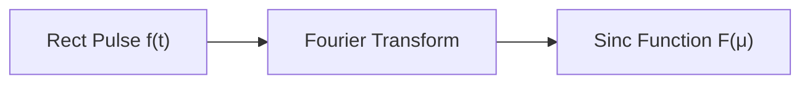

## Introduction

- Fourier's ideas have significantly impacted various industries and academic disciplines.
- The Fast Fourier Transform (FFT) algorithm, discovered in the early 1960s, revolutionized signal processing.
- **Goal:** To understand how the Fourier Transform and frequency domain can be applied to image filtering.

## Complex Numbers

- A complex number *C* is defined as:
  $C = R + jI$
  where:
    -  *R* is the **real part**.
    -  *I* is the **imaginary part**.
    - $j$ is an imaginary number such that $j^2 = -1$.

- **Complex Number Operations:**
    - Addition: $(a + jb) + (c + jd) = (a + c) + j(b + d)$
    - Multiplication: $(a + jb)(c + jd) = (ac - bd) + j(bc + ad)$
    - Conjugate: $\overline{a + jb} = a - jb$

- **Polar Coordinates Representation:**
  $C = (R + jI) = \sqrt{R^2 + I^2}(\cos\theta + j\sin\theta)$
  $\theta = \arctan(I/R)$

- **Euler's Formula:**
  $e^{j\theta} = \cos\theta + j\sin\theta$

- **Magnitude and Phase**
   $C = \sqrt{CC}e^{j\theta}$

## Fourier's Basic Idea

- Any *periodic* function (with period *T*) can be expressed as the sum of sines and cosines of different frequencies, each multiplied by a different coefficient.  This is the *Fourier Series*.

- **Fourier Series:**
  $f(x) = \sum_{n=-\infty}^{\infty} c_n e^{j2\pi\frac{n}{T}x}$
  $c_n = \frac{1}{T}\int_{-T/2}^{T/2} f(x)e^{-j2\pi\frac{n}{T}x} dx$, for $n \in \mathbb{Z}$

- For non-periodic functions (with finite area under the curve), we use an integral instead of a sum:

  $f(x) = \int_{-\infty}^{\infty} F(\mu)e^{j2\pi\mu x} d\mu$
   where F($\mu$) is a weigthing function.

## Continuous Fourier Transform

- **Fourier Transform:**
  $F(\mu) = \int_{-\infty}^{\infty} f(x)e^{-j2\pi\mu x} dx$

- *Even if f(x) is real, its transform, in general, is a complex function.*

- The domain of the Fourier transform is called the **frequency domain**.

- **Polar Form:**
  $F(\mu) = |F(\mu)|e^{j\theta(\mu)}$
  where:
    - $|F(\mu)| = \sqrt{R^2(\mu) + I^2(\mu)}$ is the **Fourier spectrum** (magnitude).
    - $\theta(\mu) = \arctan\frac{I(\mu)}{R(\mu)}$ is the **phase angle**.

- **Inverse Fourier Transform:**
  $f(x) = \int_{-\infty}^{\infty} F(\mu)e^{j2\pi\mu x} d\mu$

- **Example: Fourier Transform of a Rectangular Pulse**

  Given:
   $$
   f(t) = \begin{cases}
    0 & t < -W/2 \\
    A & -W/2 \le t \le W/2 \\
    0 & t > W/2
    \end{cases}
$$

  The Fourier Transform is:
  $F(\mu) = \int_{-W/2}^{W/2} Ae^{-j2\pi\mu t} dt = AW\frac{\sin(\pi\mu W)}{\pi\mu W}$

## Discrete Fourier Transform (DFT)

- In practice, we work with *finite* functions (assumed to be periodic) composed of a finite number of *M* discrete samples.

- **Discrete Fourier Transform:**
  $F(u) = \sum_{x=0}^{M-1} f(x)e^{-j2\pi ux/M}$,   $u = 0, 1, ..., M-1$

- **Discrete Inverse Fourier Transform:**
  $f(x) = \frac{1}{M}\sum_{u=0}^{M-1} F(u)e^{j2\pi ux/M}$,   $x = 0, 1, ..., M-1$

- **DFT in terms of sines and cosines:**

  $F(u) = \sum_{x=0}^{M-1} f(x)[\cos(-2\pi ux/M) + j\sin(-2\pi ux/M)]$

- The Fourier Transform is essentially a **change of basis** from the spatial domain to the frequency domain.

- **Matrix Representation of the DFT:**
   The DFT can be represented as a matrix multiplication where the rows and columns of the Fourier matrix are orthogonal. It's a basis on N-dimensional complex vector.

$$
F(μ) =

\begin{bmatrix}
e^{-j \frac{2\pi}{M} \cdot 0 \cdot 0} & e^{-j \frac{2\pi}{M} \cdot 0 \cdot 1} & \dots & e^{-j \frac{2\pi}{M} \cdot 0 \cdot (M-1)} \\
e^{-j \frac{2\pi}{M} \cdot 1 \cdot 0} & e^{-j \frac{2\pi}{M} \cdot 1 \cdot 1} & \dots & e^{-j \frac{2\pi}{M} \cdot 1 \cdot (M-1)} \\
\vdots & \vdots & \ddots & \vdots \\
e^{-j \frac{2\pi}{M} \cdot (M-1) \cdot 0} & e^{-j \frac{2\pi}{M} \cdot (M-1) \cdot 1} & \dots & e^{-j \frac{2\pi}{M} \cdot (M-1) \cdot (M-1)}
\end{bmatrix}

\cdot
\begin{bmatrix}
f(0) \\
f(1) \\
\vdots \\
f(M-1)
\end{bmatrix}

$$
## Properties of the DFT

### Periodicity

- The Fourier Transform of a real function is periodic.
- The Fourier spectrum from 0 to M-1 consists of two back-to-back half periods meeting at M/2.
- $f(x)(-1)^x \Leftrightarrow F(u - M/2)$  (This shifts the center of the spectrum).

### Symmetry

- The DFT of a *real* function is conjugate symmetric with respect to the origin.  The inverse is also true: the iDFT of a conjugate symmetric function yields a real function.

- $F(\mu) = \sum_{x=0}^{M-1} f(x)e^{-j2\pi\mu x/M}$
- $F(M - \mu) = \sum_{x=0}^{M-1} f(x)e^{-j2\pi(M-\mu)x/M}  = \sum_{x=0}^{M-1} f(x)e^{-j2\pi x}e^{j2\pi\mu x/M} =  \sum_{x=0}^{M-1} f(x)e^{j2\pi\mu x/M} = \overline{F(\mu)}$
- Because: $e^{-j2\pi k} = 1, \forall k$

## 2D Discrete Fourier Transform (2D DFT)

- The DFT can be extended to any dimension.  The 2D DFT is particularly useful for images.

- **2D Discrete Fourier Transform:**
  $F(u, v) = \sum_{x=0}^{M-1}\sum_{y=0}^{N-1} f(x, y)e^{-j2\pi(ux/M + vy/N)}$

- **2D Discrete Inverse Fourier Transform:**
  $f(x, y) = \frac{1}{MN}\sum_{u=0}^{M-1}\sum_{v=0}^{N-1} F(u, v)e^{j2\pi(ux/M + vy/N)}$

### 2D DFT Properties

- **Periodicity and Symmetry:**  Similar to the 1D case, the 2D DFT exhibits periodicity and symmetry in both the *u* and *v* directions.

- **Spectrum and Phase Angle:**
    - The spectrum represents the magnitudes of the sinusoidal components.
    - The phase angle represents the spatial shifts of these components.

- **Translation:** Translating  `f(x, y)` does *not* change the Fourier spectrum, only the phase angle.

    $f(x - x_0, y - y_0) \Leftrightarrow F(u, v)e^{-j2\pi(x_0u/M + y_0v/N)}$
    $f(x, y)e^{j2\pi(u_0x/M + v_0y/N)} \Leftrightarrow F(u - u_0, v - v_0)$

- **Rotation:** Rotating `f(x, y)` by an angle θ rotates `F(u, v)` by the same angle.

## DFT Spectrum and Phases

- **Spectrum:** Determines the *amplitudes* of the sinusoids that compose the image, thus influencing image intensities.
- **Phase:** Measures the *displacement* of the sinusoids, providing crucial information about the location of discernible objects in the image.  The phase carries much more information about object location than the spectrum.

- **Examples:**
    - Reconstructing an image using only the phase angle preserves object outlines but loses intensity information.
    - Reconstructing an image using only the spectrum loses object location information but retains some intensity characteristics.
    - Combining the phase of one image with the spectrum of another results in an image where object locations are determined by the phase image, and overall intensity appearance is influenced by the spectrum image.

## 2D Convolution Theorem

- **Convolution in Spatial Domain = Multiplication in Frequency Domain:**
  $f(x, y) * h(x, y) \Leftrightarrow F(u, v)H(u, v)$

- **Multiplication in Spatial Domain = Convolution in Frequency Domain:**
  $f(x, y)h(x, y) \Leftrightarrow F(u, v) * H(u, v)$

## Frequency Domain Filtering

- **Process:**
    1. Modify the Fourier Transform of an image, `F(u, v)`.
    2. Compute the inverse transform to obtain the processed result.

- **Equation:**
  $g(x, y) = \mathcal{F}^{-1}[H(u, v)F(u, v)]$
    -  $g(x, y)$:  Processed image.
    -  $H(u, v)$:  Filter function.
    -  $F(u, v)$:  DFT of the input image.
    -  $\mathcal{F}^{-1}$: Inverse Fourier Transform.

## Types of Filters:

### Low-pass Filters

- **Purpose:** Attenuate high frequencies (sharp transitions, edges, noise) while passing low frequencies (smooth areas).  This results in *blurring*.

- **Types:**

    1.  **Ideal Low-pass Filter (ILPF):**

        $H(u, v) = \begin{cases} 1 & \text{if } D(u, v) \le D_0 \\ 0 & \text{if } D(u, v) > D_0 \end{cases}$
          - $D(u,v)$ is the distance from point $(u,v)$ to the origin of the frequency rectangle.
          - $D_0$: Cutoff frequency (radius of the circle).
        - *Causes ringing artifacts due to the sharp cutoff.*

    2.  **Butterworth Low-pass Filter (BLPF):**

        $H(u, v) = \frac{1}{1 + [D(u, v)/D_0]^{2n}}$
          -  *n*: Order of the filter (controls the steepness of the transition).
          -  $D_0$: Cutoff frequency.
        - *Smoother transition than ILPF, reducing ringing.*

    3.  **Gaussian Low-pass Filter (GLPF):**

        $H(u, v) = e^{-D^2(u, v) / 2D_0^2}$
          - $D_0$: Cutoff frequency (standard deviation).
        - *No ringing artifacts, as the filter is smooth in both domains.*

### High-pass Filters

- **Purpose:** Attenuate low frequencies (smooth areas) while passing high frequencies (edges, noise). This *sharpens* the image but can reduce contrast.

- **Types:**

    1.  **Ideal High-pass Filter (IHPF):**

        $H(u, v) = \begin{cases} 0 & \text{if } D(u, v) \le D_0 \\ 1 & \text{if } D(u, v) > D_0 \end{cases}$
          - *Opposite of ILPF.*

    2.  **Butterworth High-pass Filter (BHPF):**

        $H(u, v) = \frac{1}{1 + [D_0/D(u, v)]^{2n}}$

    3.  **Gaussian High-pass Filter (GHPF):** Can be derived, but less common than its low-pass counterpart.  Usually, high-pass filtering is achieved by subtracting a low-pass filtered image from the original.

### Laplacian Filter

- The Laplacian can be implemented in the frequency domain:

  $H(u, v) = -4\pi^2(u^2 + v^2)$

- Laplacian of an image:
  $\nabla^2 f(x, y) = \mathcal{F}^{-1}\{H(u, v)F(u, v)\}$

- Laplacian filtering (for sharpening):
  $g(x, y) = f(x, y) + c\nabla^2 f(x, y)$

### Notch Filters

- **Purpose:** Reject (or pass) frequencies within a predefined neighborhood around the *center* of the frequency rectangle.

- **Conjugate Symmetry:** Notch filters must be conjugate symmetric about the origin.  If a notch is centered at $(u_0, v_0)$, there must be a corresponding notch at $(-u_0, -v_0)$.

- **Construction:**  Often created as products of high-pass filters whose centers have been translated to the notch locations.
- **Notch Reject Filter Function:**
  $H_{NR}(u,v) = \prod_{k=1}^{Q}H_k(u,v)H_{-k}(u,v)$
      - Where $H_k$ and $H_{-k}$ are High Pass Filters centered in $(u_k, v_k)$ and $(-u_k, -v_k)$

- **Application:** Removing periodic noise (e.g., moiré patterns) by placing notches at the frequencies corresponding to the noise.

## Image Restoration

- **Degradation Model:** Degradation is often modeled as a degradation function *h(x, y)* and additive noise $\eta(x, y)$.

  $g(x, y) = h(x, y) * f(x, y) + \eta(x, y)$

- **Frequency Domain Representation:**
  $G(u, v) = H(u, v)F(u, v) + N(u, v)$

- **Inverse Filtering (Simplest Case - No Noise):**
    - If noise is absent and *H(u, v)* is known, we can estimate the original image:
    $\hat{F}(u,v) = \frac{G(u,v)}{H(u,v)}$
    - Very unstable with noise, particularly when *H(u, v)* has zero or very small values.

- **Wiener Filtering:**
    - A statistical approach that considers images and noise as random variables.
    - **Goal:** Minimize the mean square error between the estimated image ($\hat{f}$) and the original image (*f*).
    - **Assumptions:**
        - Noise and image are uncorrelated.
        - Noise or image has zero mean.
        - Intensity levels in the estimate are a linear function of the degraded image's levels.

    - **Wiener Filter Equation:**
      $\hat{F}(u, v) = \left[ \frac{1}{H(u, v)} \frac{|H(u, v)|^2}{|H(u, v)|^2 + S_\eta(u, v)/S_f(u, v)} \right] G(u, v)$
          - $S_\eta(u,v)$: Noise power spectrum
          - $S_f(u,v)$: Undegraded image power spectrum
          - $\frac{S_\eta(u,v)}{S_f(u,v)}$ is Noise to signal ratio
