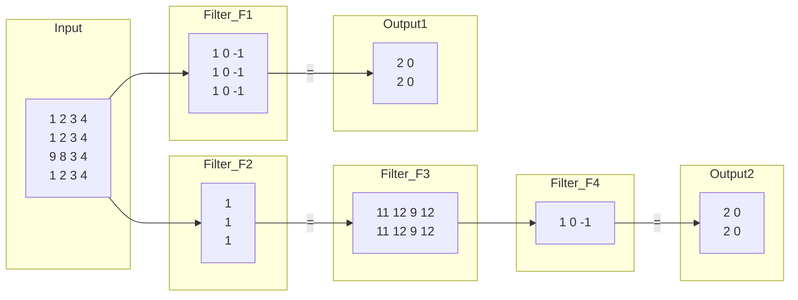
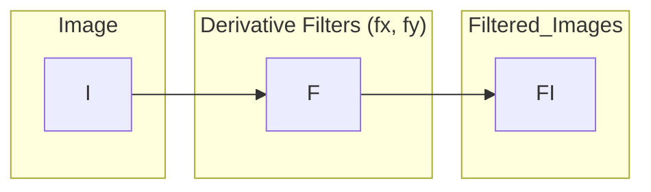
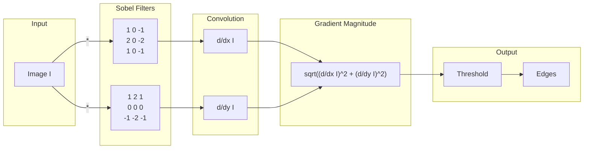
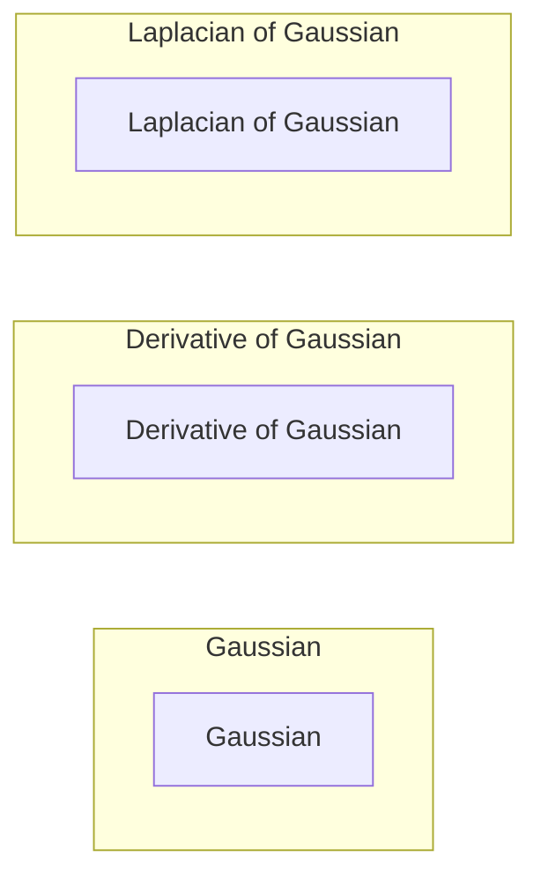

## 1. Introduction to Filtering

Image filtering modifies an image, often to enhance certain features or remove noise.

**Example of simple filtering operations**

## 2. Edge Detection

Edges represent significant local changes in image intensity.  They often correspond to boundaries between objects or regions.

### 2.1. Detecting Edges with Derivatives

*   **Concept:**  Edges are located where the image intensity changes rapidly.  Mathematically, this corresponds to high values in the image's *derivative*.

*   **Process:**
    1.  Take the derivative of the image.
    2.  High magnitude values in the derivative indicate edges.

*   **Discrete Images:**  Since images are discrete (pixel grids), we use *finite differences* to approximate derivatives.

### Example

**Explanation:**
* `fx` typically represents a filter that calculates the derivative in the horizontal (x) direction.
* `fy` calculates the derivative in the vertical (y) direction.
* The filtered images show areas of high change in each direction, highlighting edges.

## 3. Derivative Filters

### 3.1. Finite Differences

Finite differences are approximations of derivatives for discrete data.

*   **First-order finite difference (forward difference):**
    $f'(x) \approx \frac{f(x + h) - f(x)}{h}$
    , where *h* is a small step (usually 1 pixel).  A simplified version for a 1D signal is often represented by the filter:  `[1, -1]`(backward) or`[-1,1]`(forward).

*  **Centered difference:**
A more accurate representation. The centered differece would look like:
`[-1, 0, 1]`

### 3.2. Sobel Filter

The Sobel filter is a widely used edge detection filter. It combines a derivative calculation with smoothing.

*   **Separability:** The Sobel filter is *separable*, meaning it can be implemented as a combination of two 1D filters.  This improves computational efficiency.

*   **Horizontal Sobel Filter (Gx):** Detects vertical edges.

    $G_x = \begin{bmatrix} 1 & 0 & -1 \\ 2 & 0 & -2 \\ 1 & 0 & -1 \end{bmatrix} = \begin{bmatrix} 1 \\ 2 \\ 1 \end{bmatrix} * \begin{bmatrix} 1 & 0 & -1 \end{bmatrix}$

    *   The `[1, 2, 1]` part is a smoothing filter (a "tent" filter, similar to a Gaussian).
    *   The `[1, 0, -1]` part is a centered difference derivative.

*   **Vertical Sobel Filter (Gy):** Detects horizontal edges.

    $G_y = \begin{bmatrix} 1 & 2 & 1 \\ 0 & 0 & 0 \\ -1 & -2 & -1 \end{bmatrix} = \begin{bmatrix} 1 \\ 0 \\ -1 \end{bmatrix} * \begin{bmatrix} 1 & 2 & 1 \end{bmatrix}$

* **1D Derivative Filter**:
`[1, 0, -1]`

* **What is `[1,2,1]`?**: This part is related to smoothing, acts like tent or a triangle, decreasing linearlly from centre to edges.

* **Return large responses**: This filter would respond strongly to *vertical* lines because it's calculating the horizontal gradient.  A large change in intensity across the horizontal direction signifies a vertical edge.

### 3.3. Other Derivative Filters

*   **Prewitt Filter:** Similar to Sobel, but without the central weighting.

    $P_x = \begin{bmatrix} 1 & 0 & -1 \\ 1 & 0 & -1 \\ 1 & 0 & -1 \end{bmatrix}$ ,  $P_y = \begin{bmatrix} 1 & 1 & 1 \\ 0 & 0 & 0 \\ -1 & -1 & -1 \end{bmatrix}$

*   **Scharr Filter:**  Provides better rotational symmetry than Sobel.

    $S_x = \begin{bmatrix} 3 & 0 & -3 \\ 10 & 0 & -10 \\ 3 & 0 & -3 \end{bmatrix}$ ,  $S_y = \begin{bmatrix} 3 & 10 & 3 \\ 0 & 0 & 0 \\ -3 & -10 & -3 \end{bmatrix}$

*   **Roberts Filter:** A simpler, 2x2 filter.

    $R_x = \begin{bmatrix} 0 & 1 \\ -1 & 0 \end{bmatrix}$ ,  $R_y = \begin{bmatrix} 1 & 0 \\ 0 & -1 \end{bmatrix}$

## 4. Computing Image Gradients

1.  **Choose a derivative filter:**  Select a filter like Sobel (Gx and Gy).

2.  **Convolve:** Convolve the image *I* with the chosen filters (e.g., $S_x$ and $S_y$).  Convolution is a sliding window operation that applies the filter at each pixel.

    $\frac{\partial f}{\partial x} = S_x * I$
    $\frac{\partial f}{\partial y} = S_y * I$

3.  **Form the Gradient:** The gradient is a vector that points in the direction of the greatest intensity change.

    *   **Gradient Magnitude:** Represents the strength of the edge.
        $||\nabla f|| = \sqrt{(\frac{\partial f}{\partial x})^2 + (\frac{\partial f}{\partial y})^2}$

    *   **Gradient Direction:**  Represents the orientation of the edge.
        $\theta = tan^{-1}(\frac{\partial f / \partial y}{\partial f / \partial x})$

## 5. Sobel Edge Detector (Complete Process)

4.  **Input Image (I):** The original image.
5.  **Sobel Filters (Gx, Gy):**  The horizontal and vertical Sobel filters.
6.  **Convolution:** The image is convolved with each Sobel filter, producing derivative images in x and y.
7.  **Gradient Magnitude:**  The magnitude of the gradient is calculated at each pixel.
8.  **Thresholding:** A threshold is applied to the gradient magnitude.  Pixels with magnitudes above the threshold are considered edges.

## 6. Intensity Profile and Edge Detection

*   An edge corresponds to a rapid change in the image intensity function.
*   If we plot the intensity along a horizontal scanline, the first derivative will show peaks or valleys at edge locations.
*   The *second derivative* will show *zero-crossings* at edge locations.

## 7. Noise and Edge Detection

*   **Problem:** Noise in the image can cause spurious, small variations in intensity, leading to many false edge detections.  Derivative filters are very sensitive to noise.

*   **Solution: Smoothing:**  Apply a smoothing filter (like a Gaussian blur) *before* applying the derivative filter.  This reduces noise and makes edge detection more robust.

## 8. Gaussian Smoothing

*   **Gaussian Filter:** A low-pass filter that blurs the image by averaging pixel values, weighted by a Gaussian function.

    $h_{\sigma}(u, v) = \frac{1}{2\pi\sigma^2}e^{-\frac{u^2 + v^2}{2\sigma^2}}$

    *   $\sigma$ (sigma) controls the amount of smoothing (larger $\sigma$ = more blurring).

*The Gaussian Blur is applied first and then the sobel filter is used*

## 9. Derivative of Gaussian (DoG)

*   **Efficiency:** Instead of applying a Gaussian and *then* a derivative filter, we can combine them into a single filter: the Derivative of Gaussian (DoG).

*   **Convolution Theorem:** The derivative of a convolution is the convolution of the derivative:
    $\frac{\partial}{\partial x}(h * f) = (\frac{\partial}{\partial x}h) * f$

    *   This means we can take the derivative of the Gaussian filter *first*, and then convolve *that* with the image.

## 10. Laplacian of Gaussian (LoG)

*   **Second Derivative:** The Laplacian is a second-order derivative operator. It highlights regions of rapid intensity change.

*   **Laplacian Filter (1D):** A simple 1D Laplacian filter is `[1, -2, 1]`.
    *Approximating 2nd order finite difference.*
     $f''(x) = lim_{h->0}\frac{f(x+h)-2f(x)+f(x-h)}{h^2}$

*   **Laplacian of Gaussian (LoG):** Combine Gaussian smoothing with the Laplacian:

    1.  Smooth the image with a Gaussian:  $\tilde{S} = g * \tilde{I}$
    2.  Apply the Laplacian: $\Delta^2 S = \frac{\partial^2}{\partial x^2}S + \frac{\partial^2}{\partial y^2}S$
    3. Find zero crossing.

*   **Zero-Crossings:** Edges are located at the *zero-crossings* of the LoG output.

* **Four cases of Zero Crossings**: {+,-},{+,0,-},{-,-},{-,0,+}.
* **Slope of Zero Crossings:** {a,-b} is |a+b|.

*   **Advantages:** LoG is less sensitive to noise than a simple Laplacian, and zero-crossings provide precise edge localization.

* **Disadvantage:** LoG is still susceptible to noise and, can cause spurious edges detected.

## 11. 2D Gaussian, DoG, and LoG (Visualized)

*   **Gaussian:** A bell-shaped curve.
*   **DoG:**  Looks like a "Mexican hat" (a positive peak surrounded by a negative region).
*   **LoG:** Also has a characteristic shape with positive and negative regions.

This comprehensive breakdown covers all the key concepts and equations from the provided slides, making it a suitable resource for digital notes.  The MathJax formatting ensures correct mathematical representation, and the Mermaid diagrams provide visual aids where appropriate.
