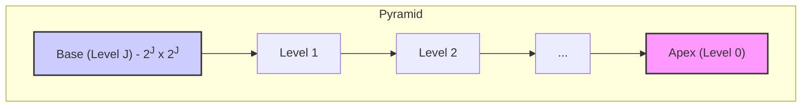
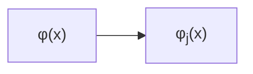
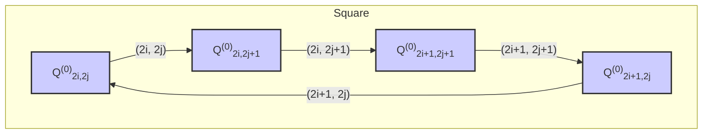

## Introduction to Wavelets

*   **Fourier Transform:** Basis functions are sinusoids.
*   **Wavelets:** Based on small waves (wavelets) of varying frequency and limited duration.  These account for both *frequency* and *location* of that frequency.
*   **Temporal Information:** Wavelets capture temporal information in addition to frequency, making them localized in both time and frequency domains. Unlike the Fourier Transform, which uses oscillating functions that exist across infinite duration, wavelets decay to zero.
*   **Multiresolution Theory:**  An approach to signal processing concerned with representing and analyzing images at different resolutions.  Features not prominent at one level might be easily detected at another.

## Comparison with Fourier Transform

*   **Fourier Transform:** Analyzes signals by converting them into a continuous series of sine and cosine functions, each with constant frequency, amplitude, and infinite duration.
*   **Wavelets:**
    *   Deal with real-world signals, which are finite and can have abrupt changes.
    *   Based on a **mother wavelet**, denoted by $\psi(x)$.
    *   **Wavelet Transform:** Converts a signal into a series of wavelets.
    *   Basis functions are created by *scaling* and *shifting* the mother wavelet:

        $\psi_{a,b}(x) = \frac{1}{\sqrt{a}}\psi\left(\frac{x-b}{a}\right)$

        where:
        *   $b$: Translation (location of wavelet)
        *   $a > 0$: Scaling (governs frequency, $a$ goes in denominator. Bigger $a$ means longer wavelet).

* **Advantages of Wavelets:**
	* More Efficient Storage: Signals processed by wavelets can theoretically be stored more efficiently.
	* Better Approximation: Wavelets with rough edges can better approximate real-world signals.
	* Information Movement: Wavelets move information around rather than deleting it, allowing for better noise separation, separating the *detail/noise* and the *average*. Expressed as the sum and differences.
		* Image: Signal defined by pixel data.
		* Average and Detail: Represented by sum and difference of pixels.
		* Filters: Low-pass filter for average, high-pass filter for detail.

## Multiresolution Analysis

*   **Concept:**  Representation and analysis of images at *more than one resolution*.
*   **Feature Detection:** Enables detection of features at different scales.
    *   **Finest scale:** Average and detail computed by sum and difference of neighboring pixels.
    *   **Coarser levels:**  Created recursively by taking the sum and difference of the previous levels.

## Background

*   **Image Objects:** Connected regions of similar texture and intensity.
*   **Resolution and Object Size:**
    *   High resolution: For small objects.
    *   Coarse resolution: For large objects.

## Wavelet Properties (Page 2 of PDF)

*   Images have local variations. It's difficult to model variations over entire image.
* Two key properties: **Admissibility** and **Regularity**.
* ### Admissibility
    * Mathematically expressed as:
    $\int_{-\infty}^{\infty} \frac{|\Psi(\omega)|^2}{|\omega|} d\omega < \infty$

      where:
      *   $\psi(t)$: Wave in the time domain.
      *   $\Psi(\omega)$: Fourier transform of $\psi(t)$.
    * In Practice, admissibility criterion can be simplified to:

       $\Psi(0) = 0$, or equivalently, $\int_{-\infty}^{\infty} \psi(t)dt = 0$.

     *Implication:*  The wavelet transform must integrate to zero. The average value in time domain must be 0. It's well localized.

    * Wavelet defined between $0 \le t \le N$.
    * Provides basis functions $\psi_{jk}(t)$.
    * $\psi_{jk}(t)$ is a set of Linearly Independant functions, to form $f(t)$.
    * $f(t) = \sum_{j,k} b_{jk}\psi_{jk}(t)$
        * $\psi_{jk} = \psi(2^j \cdot t - k)$
        * $j$: Compression
        * $k$: Shifting
        * $b_{jk}$: coefficient
        * $\psi_{0k} = \psi(t-k)$, defined over interval where $k \le t \le k + N$, signal is *shifted*.
        * $\psi_{j0} = \psi(2^j \cdot t)$, defined over $0 \le t \le \frac{N}{2^j}$, signal is *compressed*.

* ### Regularity

    *   Ensures the wavelet transform decreases quickly with decreasing scale.
    *   The wavelet function should be smooth and concentrated in both time and frequency.
 * **Wave** and **let**: Admissibility forms the *wave* component, Regularity forms the *let* component, which implies a fast decay.

## Image Pyramids (Page 2 of PDF)

*   **Structure:**  Represent images at multiple resolutions.  A collection of decreasing resolution images arranged in a pyramid shape.
*   **Highest Resolution:**  At the pyramid base (Level $J$).
*   **Resolution and Size:**  Decrease as you move up the pyramid.
*   **Base Level:** Size $2^J \times 2^J$.
*   General Level $j$ size: $2^j \times 2^j$, $0 \le j \le J$.
* Number of Pixels:
	$N^2 (1 + \frac{1}{4} + \frac{1}{4^2} + ... + \frac{1}{4^P}) \le \frac{4}{3}N^2$

* ### Building Image Pyramids (Iterative Process)

    1.  **Compute Reduced-Resolution Approximation:**  Filter and downsample (by a factor of 2) the level $j$ input image. Place the result at level $j-1$ of the approximation pyramid.
    2.  **Create Estimate of Level j Input:** Upsample and filter the reduced resolution approximation from step 1.  The resulting prediction image has the same dimensions as the level $j$ input.
    3.  **Compute Difference:**  Subtract the prediction image (step 2) from the input (step 1). Place the result in level $j$ of the *prediction residual pyramid*.

*  After $P$ iterations: Level $J-P$ approximation output is placed in the pyramid at level $J-P$.
*   **Types of Pyramids (based on filters):**
    *   Mean pyramids (neighborhood averaging)
    *   Gaussian pyramids (lowpass Gaussian filtering)
    *   Subsampling pyramids (no filtering)
    * Filter can be based on: Nearest, Bilinear, Bicubic.

## Upsampling and Downsampling

*   **Upsampling:**
    *   Doubles the spatial dimensions of approximation images.
    *   Given a 1D sequence $f(n)$, the upsampled sequence is:

        $f_{2\uparrow}(n) = \begin{cases}
        f(n/2) & \text{if } n \text{ is even} \\
        0 & \text{otherwise}
        \end{cases}$

        Insert a 0 after every value in sequence.

*   **Downsampling:**
    *   Halves the spatial dimensions of the prediction images.
    *   Given by:

        $f_{2\downarrow}(n) = f(2n)$
     *Discard every other sample.*

## Subband Coding (Page 4 PDF)

*   **Subbands:**  A set of band-limited components resulting from decomposing an image.
*   **Decomposition:** Done such that subbands can be reassembled to reconstruct the original image *without error*.

* ### Digital Filter (Fig 7.4a)
   * Components: Unit Delays, Multipliers, Adders.
   * Unit Delays: Connected in series to create $K-1$ delayed (right shifted) versions of input sequence $f(n)$.

        $f(n - 2) = \begin{cases}
          f(0) & \text{for } n = 2 \\
          f(1) & \text{for } n = 2 + 1 = 3 \\
          \vdots
        \end{cases}$
    *Input Sequence:* $f(n) = f(n-0)$
    *Delayed Sequence:* Output of Unit Delays.
    *Multiplication:* Delayed sequences are multiplied by constants $h(0), h(1), ..., h(K-1)$ , called *filter coefficients*.
        $\hat{f}(n) = \sum_{k=-\infty}^{\infty} h(k)f(n-k) = f(n)*h(n)$
        * Each Coefficient is a Filter Tap.
        * Filter is of Order $K$
        * Input: Unit discrete impulse.
        $\hat{f}(n) = \sum_{k=-\infty}^{\infty} h(k)\delta(n-k) = h(n)$
            *Substitute* $\delta(n)$ *for* $f(n)$.
            *Sifting Property*: The unit impulse response of the filter is the K-element sequence of coefficients. Impulse is shifted left to right.

* ### Two-Band Subband Coding and Decoding (Fig 7.6a)

    *   Two filter banks, each containing two FIR (Finite Impulse Response) filters.
    *   **Analysis Filter Bank:**
        *   Uses filters $h_0(n)$ (lowpass) and $h_1(n)$ (highpass) to split the input sequence $f(n)$ into two downsampled sequences $f_{lp}(n)$ (approximation) and $f_{hp}(n)$ (detail).
    *   **Synthesis Filter Bank:**
        *   Uses filters $g_0(n)$ and $g_1(n)$ to combine the output of the analysis bank to produce $\hat{f}(n)$.

    * **Goal:** Select $h_0(n)$, $h_1(n)$, $g_0(n)$, and $g_1(n)$ such that $f(n) = \hat{f}(n)$ (*perfect reconstruction filters*).

## Analyzing and Synthesizing Wavelets

*   **Analyzing Wavelet:**  Analog bandpass filter with scaling and translation properties.  Implemented as a convolution.  Breaks the input sequence into two half-length sequences (approximation and detail).
*   **Synthesizing Wavelet:** Used with a scaling (smoothing) function to represent a signal from its lowpass features (background) and bandpass details (high frequency).
* **Building:**
    Need to build analyzing/synthesizing *wavelets*, and *scaling functions* (lowpass/smoothing) to ensure signal is reconstructed.
    *Many two-band, real-coefficient, FIR, perfect filter banks exist.*
    Synthesis Filters are *modulated* versions of analysis filters. One synthesis filter is *sign reversed*.
    $g_0(n) = (-1)^n h_1(n)$
    $g_1(n) = (-1)^{n+1}h_0(n)$
    *OR*
    $g_0(n) = (-1)^{n+1}h_1(n)$
    $g_1(n) = (-1)^nh_0(n)$
    *Cross-modulated Filters*

## Orthogonality and Orthonormality (Page 6 of PDF)

*   **Orthogonality:**  Inner products of wavelets are zero.

    $\int_{-\infty}^{\infty} \psi_{jk}(t) \cdot \psi_{j'k'}(t) dt = 0$

*   **Orthogonal Basis:**  Formed by wavelets for the space of admissible functions.  Leads to a simple formula for the coefficient $b_{jk}$:

    $f(t) = \sum_{j,k} b_{jk}\psi_{jk}(t)$

    Multiplying both sides by $\psi_{j'k'}(t)$ and integrating, we get, using orthogonality:

    $\int_{-\infty}^{\infty} f(t)\psi_{j'k'}(t)dt = b_{jk} \int_{-\infty}^{\infty} (\psi_{j'k'}(t))^2 dt$

    $b_{jk} = \frac{\int_{-\infty}^{\infty} f(t)\psi_{j'k'}(t)dt}{\int_{-\infty}^{\infty} (\psi_{j'k'}(t))^2 dt}$
*  **Biorthogonality Condition:**
    $<h_i(2n - k), g_j(k)> = \delta(i-j)\delta(n), i,j = \{0,1\}$
    * If $i \ne j$, the inner product is 0
    * If $i=j$, inner product is $\delta(n)$ which is the *unit discrete impulse function*.

*   **Orthonormality:**  Used in subband coding to develop the fast wavelet transform.

    $<g_i(n), g_j(n + 2m)> = \delta(i - j)\delta(m),  i, j = \{0, 1\}$

    Orthonormal filters satisfy:

    $g_1(n) = (-1)^n g_0(K_{even} - 1 - n)$
    $h_i(n) = g_i(K_{even} - 1 - n), i = \{0, 1\}$
    *$K_{even}$ implies number of coefficients must be even*
    *$g_1$ is related to $g_0$ by order reversal and modulation.*
    *$h_0$ and $h_1$ are order-reversed versions of $g_0$ and $g_1$.*

    *Orthonormal filter bank developed by the impulse response of a single filter, called **Prototype**.*

## From 1D to 2D Filters

* Apply downsampling twice, results in four subbands.
	* Approximation
	* Vertical Detail
	* Horizontal Detail
	* Diagonal Detail
## Haar Wavelet (Page 7 of PDF)

*   Oldest and simplest orthonormal wavelet.
*   Expressed in matrix form:

    $\mathbf{T} = \mathbf{H}\mathbf{F}\mathbf{H}^T$

    where:
    *   $\mathbf{F}$:  $N \times N$ image matrix, $N = 2^n$.
    *   $\mathbf{H}$: $N \times N$ Haar transformation matrix, contains basis functions $h_k(z)$.
    *   $\mathbf{T}$: Resulting $N \times N$ transform.
*  Haar basis functions are defined on continous closed interval $z \in [0,1]$ where $k = 0,1,...N$, $N=2^n$
*   $\mathbf{H}$ is *not* symmetric.
*  H is created by:
    $k = 2^p + q -1$
    $0 \le p \le n-1, q=0$ or $1$ for $p=0$, and $1 \le q \le 2^p$ for $p \ne 0$
*   Haar basis functions:

    $h_0(z) = h_{00}(z) = \frac{1}{\sqrt{N}}, \quad z \in [0, 1]$

    $h_k(z) = h_{pq}(z) = \frac{1}{\sqrt{N}} \begin{cases}
    2^{p/2} & (q-1)/2^p \le z < (q-0.5)/2^p \\
    -2^{p/2} & (q-0.5)/2^p \le z < q/2^p \\
    0 & \text{otherwise}, \quad z \in [0, 1]
    \end{cases}$

* The $i$-th row of an $N\times N$ Haar Matrix, contains the elements of $h_i(z)$ for $z = 0/N, 1/N,...(N-1)/N$.
    *For $N=2$, first row of $2 \times 2$ matrix is $h_0(z)$ for $z = 0/2, 1/2$ which is $\frac{1}{\sqrt{2}}$.*
    *Second Row, compute $h_1(z)$ for $z=0/2, 1/2$:*
    *$k = 2^p + q - 1$ where $k=1$, then $p=0$ and $q=1$.*
    *$h_1(0) = \frac{2^{0/2}}{\sqrt{2}} = \frac{1}{\sqrt{2}}$*
    *$h_1(1/2) = \frac{-2^{0/2}}{\sqrt{2}} = \frac{-1}{\sqrt{2}}$*
    *Resulting matrix is:*
    $H_2 = \frac{1}{\sqrt{2}} \begin{bmatrix} 1 & 1 \\ 1 & -1 \end{bmatrix}$
## Haar Scaling and Wavelet Functions (Page 8)
* $f$ one dimension, $-\infty$ to $+\infty$.
* Haar *scaling* function: $\phi(t)$
* Haar *wavelet* function: $\psi(t)$
* Haar *scaling* (averaging, lowpass filter) function at level 0:
    $\phi(x) = \begin{cases} 1 & 0 \le x < 1 \\ 0 & \text{otherwise} \end{cases}$

*   Translation by $j$: $\phi_j(x) = \phi(x-j)$

* Coefficients of f:
    $c_j(f) = \int f(x)\phi_j(x)dx$ = Average of f over $[j, j+1]$.

* Approximate Reconsctruction:
    $f_0(x) = \sum_j c_j(f)\phi_j(x)$
    * Ideally, get finer scale for sampling.
    * In Images, smallest scale is one pixel and we start at this level.
        *Sum and differences of neighboring pixels are at the *finest scale*.*
    *Go to a *coarser* level using the family: $\{\phi_j^{(1)}\}$
    $\phi_j^{(1)}(x) = \phi(\frac{1}{2}x - j)$
    $\phi(\frac{1}{2}x-j) = \begin{cases} 1 & 2j \le x \lt 2(j+1) \\ 0 & \text{otherwise} \end{cases}$
    Signals are at Level 1:
    $c_j^{(1)}(f) = \frac{1}{2} \int f(x) \phi_j^{(1)}(x)dx = \text{average of f over } [2j, 2(j+1)]$

* Averaging at larger scale leads to loss of information.
* Lost Detail:
    * $\phi^{(0)}$ is $\phi$ at Level 0.
    * $\phi_j^{(1)} = \phi_{2j}^{(0)} + \phi_{2j+1}^{(0)}$
        * $c_j^{(1)} = \frac{c_{2j}^{(0)} + c_{2j+1}^{(0)}}{2}$
    * Detail Preserved by new coefficient: (Highpass Filter)
        * $d_j^{(1)} = \frac{c_{2j}^{(0)} - c_{2j+1}^{(0)}}{2}$
        * $c_j^{(1)} + d_j^{(1)} = c_{2j}^{(0)}$
        * $c_j^{(1)} - d_j^{(1)} = c_{2j+1}^{(0)}$
    * Haar wavelet Average ($\phi$) and Detail ($\psi$) coefficients at Level 1:
        * $\psi_j^{(1)} = \frac{1}{2}[\phi_{2j}^{(0)} - \phi_{2j+1}^{(0)}]$
        * $d_j^{(1)} = \int f(x)\psi_j^{(1)}(x)dx$

## Extension of Haar Wavelet to 2D Signal (Page 10)
* 2D Sample (Square with 4 Areas)
* $Q$ represents the signal coefficients.
* $(l,p)$ center coordinates, which are $(2i+1, 2j+1)$.

*   Haar coefficient:

    $C_{l,p}(f) = \iint f(x,y)\chi_{Q_{l,p}^{(0)}}(x,y)dxdy$

    where $\chi$ is the characteristic of $Q$ at level 0:

    $\phi_{i,j}^{(1)}(x,y) = \chi_Q(x,y) = \begin{cases} 1 & (x,y) \in Q \\ 0 & (x,y) \notin Q \end{cases}$

    $Q_j^{(1)} = \bigcup_{l=2i, 2i+1 \atop p=2j, 2j+1} Q_{lp}^{(0)}$
    with,
    $Q_{(i,j)}^{(1)} = \{(x,y) | 2i \le x < 2i+1, 2j \le y < 2j+1 \}$

    Haar coefficient at level 1 is given by:

    $C_{(i,j)}^{(1)}(f) = \frac{1}{4}\iint_{Q_{(i,j)}^{(1)}} f(x,y)dxdy = \iint \phi_{i,j}^{(1)}(x,y)f(x,y)dxdy$

*   Average and detail coefficients:

    $C_{(i,j)}^{(1)}(f) = C_{2i,2j}^{(0)}(f) + C_{2i+1,2j}^{(0)}(f) + C_{2i,2j+1}^{(0)}(f) + C_{2i+1,2j+1}^{(0)}(f)$

    $D_{(i,j)}^{(1)(0,1)}(f) = C_{2i,2j}^{(0)}(f) + C_{2i+1,2j}^{(0)}(f) - C_{2i,2j+1}^{(0)}(f) - C_{2i+1,2j+1}^{(0)}(f)$

    $D_{(i,j)}^{(1)(1,0)}(f) = C_{2i,2j}^{(0)}(f) - C_{2i+1,2j}^{(0)}(f) + C_{2i,2j+1}^{(0)}(f) - C_{2i+1,2j+1}^{(0)}(f)$

    $D_{(i,j)}^{(1)(1,1)}(f) = C_{2i,2j}^{(0)}(f) - C_{2i+1,2j}^{(0)}(f) - C_{2i,2j+1}^{(0)}(f) + C_{2i+1,2j+1}^{(0)}(f)$

* Adding the coefficients (Page 11):
    $C_{(i,j)}^{(1)}(f) + \sum_{(i,j)} D_{(i,j)}^{(1)(\alpha, \beta)}(f) = C_{2i,2j}^{(0)}$
    $\phi_{ij}^{(1)}(x,y) = \sum_{l=2i}^{2i+1}\sum_{p=2j}^{2j+1} \phi_{l,p}^{(0)}(x,y)$
    $\psi_{(i,j,k)}^{(1)}(x,y) = \frac{1}{4} \sum_{l=2i}^{2i+1}\sum_{p=2j}^{2j+1} (\xi_{l,p,k})\phi_{l,p}^{(0)}(x,y)$

    $\xi_{l,p,k}$ Table

| k-> | 0 | 1 | 2 | 3  |
|-----|---|---|---|----|
| l   |   |   |   |    |
| 2i  | 1 | 1 | 1 | 1  |
|2i+1 | 1 | 1 | -1| -1 |
| p   |   |   |   |  |
|2j| 1|-1|1|-1|
|2j+1|1|-1|-1|1|
    $d_{i,j,k}^{(1)} = \int f(x,y) \psi_{(i,j,k)}^{(1)}(x,y)dxdy$
        *$k=0$ Corresponds to:*
        $\phi_{(2i,2j)}^{(1)}(x,y) = \frac{1}{4}\phi(\frac{1}{2}x-i, \frac{1}{2}y-j)$

## Discrete Wavelet Transform (DWT) (Page 11)

*   **Continuous Wavelet Transform (CWT):** Redundant because the transform is calculated by continuously shifting a continuously scalable function over a signal and calculating correlation.
* **Discrete Form:** Usually, a piecewise continuous function, sample the time-scale at discrete levels.
* **Wavelet Series Decomposition:** Transforming a continous signal into a series of coefficients.
*   Scaling function can be expressed in wavelets from $-\infty$ to $j$.
* Adding a wavelet: New scaling function, with spectrum twice as wide.
*   Two-scale relation:
    $\phi(2^jt) = \sum_k h_{j+1}(k)\phi(2^{j+1}t - k)$

    *Scaling Function (average) at given scale can be expressed by *translated* functions at next smaller scale (smaller scale = more detail).*

    $\psi(2^jt) = \sum_k g_{j+1}(k)\phi(2^{j+1}t - k)$

## Subsampling Property (Page 12)
* Step size of 2 for scaling and wavelet filters.
* Each filter bank iteration halves sample number.

## Implementation of Haar Wavelets (Page 12)
* Iteration of Filters with *rescaling*.
* *Filter Bank*: Set of Filters.
* Averaging and detail filter implemented by $2^{k-1} \times 2^k$ filtering matrices $H$ and $G$.

    $$
		\mathbf{H} = \begin{bmatrix}
    \frac{1}{2} & \frac{1}{2} & 0 & 0 & \cdots & 0 & 0 \\
    0 & 0 & \frac{1}{2} & \frac{1}{2} & \cdots & 0 & 0 \\
    \vdots & \vdots & \vdots & \vdots & \ddots & \vdots & \vdots \\
    0 & 0 & 0 & 0 & \cdots & \frac{1}{2} & \frac{1}{2}
    \end{bmatrix}
	$$

    $$
    \mathbf{G} = \begin{bmatrix}
    \frac{1}{2} & -\frac{1}{2} & 0 & 0 & \cdots & 0 & 0 \\
    0 & 0 & \frac{1}{2} & -\frac{1}{2} & \cdots & 0 & 0 \\
    \vdots & \vdots & \vdots & \vdots & \ddots & \vdots & \vdots \\
    0 & 0 & 0 & 0 & \cdots & \frac{1}{2} & -\frac{1}{2}
    \end{bmatrix}
    $$
* $H^t$ and $G^t$: Transpose of $H$ and $G$
* $I_k$ : Identity Matrix of $2^k \times 2^k$
* Properties:
    $H^t \times H + G^t \times G = \frac{1}{2}I_k$
    $H \times H^t = G \times G^t = \frac{1}{2}I_{k-1}$
    $H \times G^t = G \times H^t = 0$

* Signal: Vector of length $2^k$.
* Filtering process: Includes *downsampling* ($\downarrow 2$), decomposes $b$ into $b_1$ (block average) and $d_1$ (detail):
    $b_1 = H \times b$
    $d_1 = G \times b$

*Reconstruction*:
    $b = 2 \times (H^t \times b_1 + G^t \times d_1)$
    *Discarding $d_1$ achieves *lossy* compression*

*Applying to image*: $P$ an $r \times c$ matrix of pixels. Apply the filter to $P$, new image $P'$:
    $P' = H \times P \times H^t$
    *$r' \times c'$ Matrix:*
        $r' = \frac{r}{2}$
        $c' = \frac{c}{2}$

*Four Matrices:*
    $P_{11} = H \times P \times H^t$ (*Fully Averaged Picture*)
    $P_{12} = H \times P \times G^t$
    $P_{21} = G \times P \times H^t$
    *$P_{12}$ and $P_{21}$ are partially averaged and partially differenced pictures.*
    $P_{22} = G \times P \times G^t$ (*Fully Differenced Picture*)

* *Synthesis Filter Bank (Reconstruction)*
    $P = \begin{bmatrix} H^t & G^t \end{bmatrix} \times \begin{bmatrix} P_{11} & P_{12} \\ P_{21} & P_{22} \end{bmatrix} \times \begin{bmatrix} H \\ G \end{bmatrix}$
    * *Orthogonal Filter Bank:*
        * $\begin{bmatrix} H \\ G \end{bmatrix}^{-1} = \begin{bmatrix} H^t & G^t \end{bmatrix}$
        * $\begin{bmatrix} H^t & G^t \end{bmatrix} \begin{bmatrix} H \\ G \end{bmatrix} = H^tH + G^tG = I$
        * Synthesis Bank is inverse of Analysis Bank.
        * *Analysis Bank*: Filtering and Downsampling
        * *Synthesis Bank*: Reverses the order and performs Upsampling and Filtering.

*   **Lossy Compression:** Achieved by discarding the differenced pictures (setting the matrices to zero) and retaining only $\mathbf{P}_{11}$ during reconstruction.

## Other Wavelets

*   Haar wavelet transform may not be able to take advantage of the continuity of pixel values.
*   Other wavelets may perform better and achieve higher compression, especially for smooth textures.

## JPEG 2000 Standard

*   Based on wavelets.
*   **Scalable:** Can be decoded in many ways. Truncating the codestream gives a lower resolution representation.
*  **Computationally Demanding:** Encoders and Decoders.
*  **Artifacts:** Produces ringing artifacts at low resolutions, near edges. JPEG produces *blocking artifacts*.

* ### Comparison with standard JPEG

    *   Better scalability and editability.
    *   Superior compression.
- ### Multiresolution Representation
	*Uses DWT, to decompose image at different levels.*
	*Allows addition use, such as for presentation.*
- ### Progressive Transmission
	*Efficient code stream organization.*
	*Progressive by: Pixel Accuracy (SNR Scalability) and Image Resolution.*
	*Quality improved by downloading more data bits.*
	*Web applications in mind.*

* ### Lossless and Lossy
    *Choice of lossless and lossy compression in a single architecture.*

* ### Random Access
    *Access to different Regions of Interest (ROI).*
    *Store different parts of the same picture at different qualities.*

* ### Error Resilience
    *Robust to bit errors.*

* ### Flexible File Format
    *Color-space information and metadata.*
    *High dynamic range support.*
    *Supports any bit depth, 16/32 bit floating point images.*
    *Transparency (alpha planes).*

* ### Color Components Transformation
    *Transforms images from RGB to other colorspaces.*
    *Options:*
        * **Irreversible Color Transform**
            *Uses $YC_BC_R$ color space.*
            *Irreversible due to using floating point, and round-off errors.*
        * **Reversible Color Transform**
            *Modified $YUV$ color space. No quantization errors.*
            *Fully reversible.*
            *Transformation:*
               *Forward:*
               $Y = \lfloor \frac{R+2G+B}{4} \rfloor$
               $C_B = B - G$
               $C_R = R - G$
               *Reverse:*
                $G = Y - \lfloor \frac{C_B + C_R}{4} \rfloor$
                $R = C_R + G$
                $B = C_B + G$
            *Chrominance components can be downscaled in resolution.*
            *Downsampling is done by separating images and dropping the finest scale.*

* ### Tiling
    *Image is divided into a 2D array of samples, called *components*.*
    *Example: Color image with red, green, blue components.*
    *Image and Components are decomposed into rectangular *tiles*. These are basic units.
    *All components forming a tile, stay together.
    *Tiles can be any size, but usually, they are all the same in an image.*
        *Possible different sizes in bottom right corner.*
        *Decoder needs less memory.*
        *Option: Decode only a subset of tiles.*
    *Quality can decrease due to lower peak SNR.
    *Many tiles may lead to blocking artifacts.*

* ### Wavelet Transform (in JPEG 2000)
    *Tiles are analyzed using wavelets to create multiple decomposition levels.*
    *Co