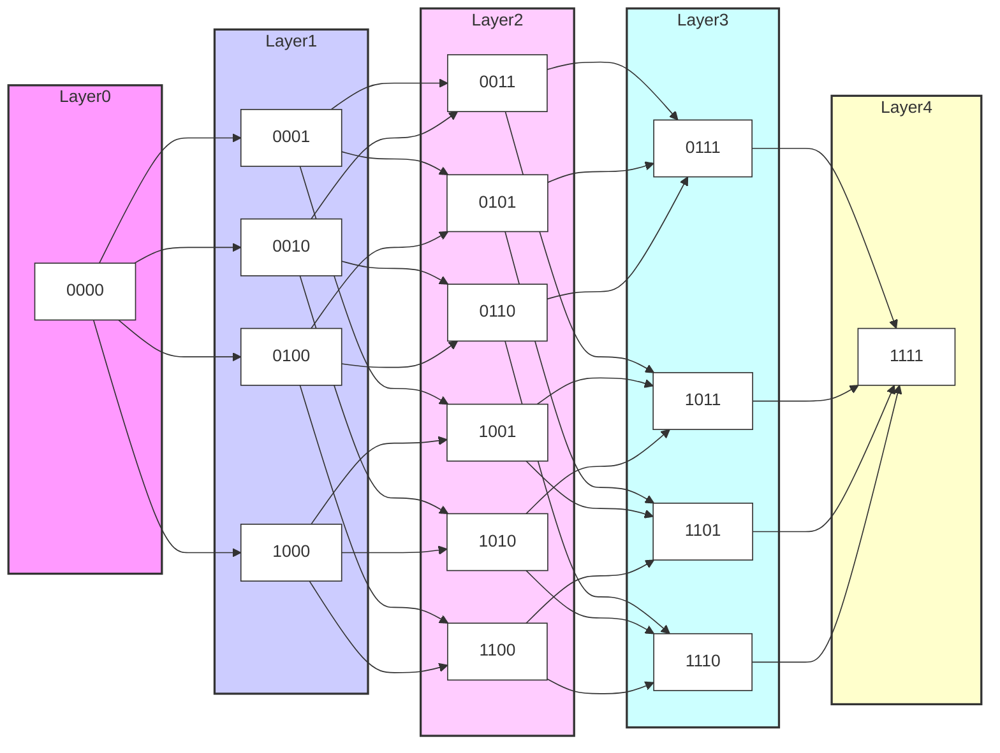

# Q4 Graph (Hypercube) in Mermaid

This README shows how to represent a 4-dimensional hypercube (Q4) graph using Mermaid. A hypercube graph has vertices representing bitstrings of length *n*, and edges connect vertices that differ in only one bit. Q4 has 2^4 = 16 vertices.


```