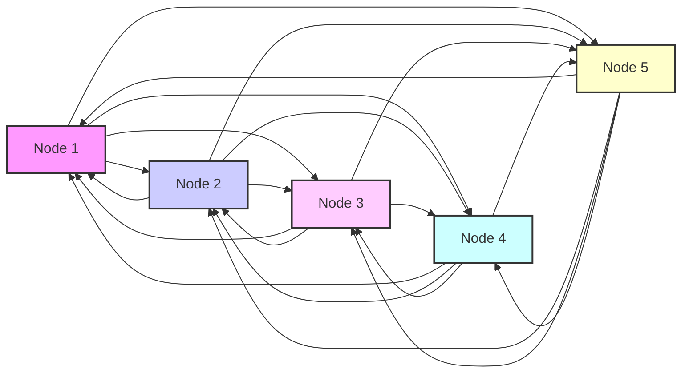

# K5 Undirected Graph Example (Mermaid)

```mermaid
graph LR;
    A[Node 1];
    B[Node 2];
    C[Node 3];
    D[Node 4];
    E[Node 5];

    A --> B;
    B --> A;
    A --> C;
    C --> A;
    A --> D;
    D --> A;
    A --> E;
    E --> A;
    B --> C;
    C --> B;
    B --> D;
    D --> B;
    B --> E;
    E --> B;
    C --> D;
    D --> C;
    C --> E;
    E --> C;
    D --> E;
    E --> D;
    

    style A fill:#f9f,stroke:#333,stroke-width:2px
    style B fill:#ccf,stroke:#333,stroke-width:2px
    style C fill:#fcf,stroke:#333,stroke-width:2px
    style D fill:#cff,stroke:#333,stroke-width:2px
    style E fill:#ffc,stroke:#333,stroke-width:2px


```

